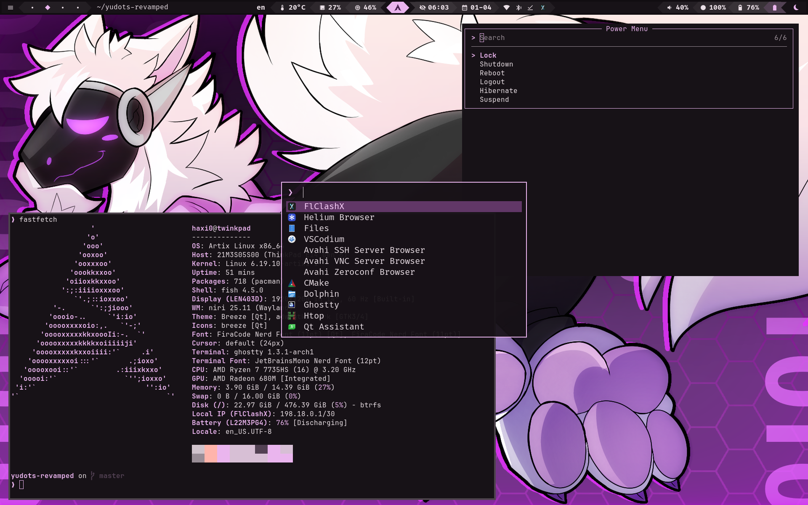

# yudots-revamped

<p align="center">
  
</p>

An opinionated Artix Linux desktop setup built around Niri, Waybar, Matugen, and a small pile of personal preferences.

This is a cleaned-up, scriptable version of my dots. It is meant for a mostly fresh Artix Linux install running OpenRC, and the installer is intentionally hands-on about replacing configs so the full setup comes up correctly.

## What This Includes

- `niri` as the compositor
- `waybar` as the status bar
- `fuzzel` as the launcher
- `mako` for notifications
- `ghostty` as the terminal
- `matugen` for wallpaper-based theming
- GTK / Qt theming, fonts, wallpapers, and helper scripts
- OpenRC service setup for desktop essentials

## Supported System

This repository is currently made for:

- Artix Linux
- OpenRC
- a clean or mostly clean user config

The installer checks for Artix and OpenRC and refuses to continue anywhere else. If you want to use these dots on Arch, another Artix init, or a different distro entirely, you will need to port them manually.

## Warning

These dotfiles are personal and opinionated.

Running the installer will:

- install a full package set, including apps you may not want
- replace matching files and directories inside `~/.config`
- replace `~/.bash_profile`
- copy bundled wallpapers into `~/.local/share/yudots-revamped`
- write Matugen wallpaper state into `~/.local/state/matugen`
- install a udev rule and an elogind config under `/etc`
- enable required OpenRC services
- switch from ConnMan to NetworkManager if needed

If you already have a heavily customized setup, back it up first.

## Installed Software

The installer pulls in a fairly complete desktop stack. The main package groups are:

### Desktop

- `dbus`
- `elogind`
- `seatd`
- `power-profiles-daemon`
- `niri`
- `xorg-xwayland`
- `xwayland-satellite`
- `xdg-desktop-portal-gnome`
- `waybar`
- `fuzzel`
- `mako`
- `swayidle`
- `swww`
- `zenity`

### Audio

- `pipewire`
- `wireplumber`
- `pipewire-pulse`
- `wiremix-git`

### Apps

- `helium-browser-bin`
- `vscodium-bin`
- `flclashx-bin`
- `dolphin`
- `ghostty`
- `fish`
- `starship`
- `matugen-bin`
- `swaylock-effects`
- `brightnessctl`
- `fzf`
- `pacman-contrib`

### Fonts And Themes

- `ttf-dejavu`
- `ttf-firacode-nerd`
- `ttf-liberation`
- `ttf-ms-fonts`
- `otf-commit-mono-nerd`
- `noto-fonts`
- `noto-fonts-cjk`
- `noto-fonts-emoji`
- `noto-fonts-extra`
- `adw-gtk-theme`
- `breeze-icons`
- `breeze-gtk`
- `qt6ct-kde`
- `qt5ct-kde`
- `breeze`
- `breeze5`

### Networking

- `bluez`
- `bluez-openrc`
- `bluez-utils`
- `networkmanager`
- `networkmanager-openrc`

## Install

Clone the repository and run the installer as your normal user:

```bash
git clone https://github.com/yureekus/yudots-revamped.git
cd yudots-revamped
chmod +x install.sh
./install.sh
```

The script uses `sudo` when needed, installs `paru` from source if it is missing, and logs the full run to `/tmp/yudots-revamped-install-YYYYMMDD-HHMMSS.log`.

## What Gets Replaced

The installer removes and recopies these paths when present:

- `~/.config/fish`
- `~/.config/fuzzel`
- `~/.config/ghostty`
- `~/.config/gtk-3.0`
- `~/.config/gtk-4.0`
- `~/.config/mako`
- `~/.config/matugen`
- `~/.config/niri`
- `~/.config/qt5ct`
- `~/.config/qt6ct`
- `~/.config/swaylock`
- `~/.config/waybar`
- `~/.bash_profile`
- `~/.local/share/yudots-revamped`

It also installs:

- `/etc/udev/rules.d/99-yudots-micmute-led.rules`
- `/etc/elogind/logind.conf.d/90-yudots-lid-lock.conf`

## Repository Structure

```text
.
|-- config/        # User config copied into ~/.config
|-- system/        # System-level files copied into /etc
|-- wallpapers/    # Bundled wallpapers copied into ~/.local/share
|-- install.sh     # Main installer
|-- preview.png    # Screenshot used in this README
`-- README.md
```

## Notes

- The installer expects a base-ish system and does not try to preserve local tweaks for matching config directories.
- If ConnMan is currently active, the script migrates to NetworkManager and checks connectivity before removing ConnMan packages.
- The installer makes sure your user is in the `video` group for brightness control and switches your login shell to `bash` if needed.
- After install, relogin or reboot. Rebooting is the safer option.

## Credits

- [end-4](https://github.com/end-4) for the original inspiration
- [mechabar](https://github.com/sejjy/mechabar) for the Waybar base and ideas

## Contributing

If you find something messy, broken, or unnecessarily annoying to use, open an issue or PR. Improvements that make the setup cleaner without making it less reproducible are especially welcome.
